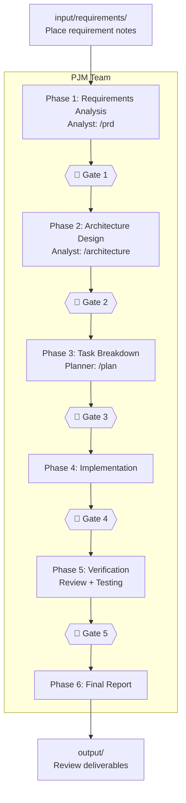
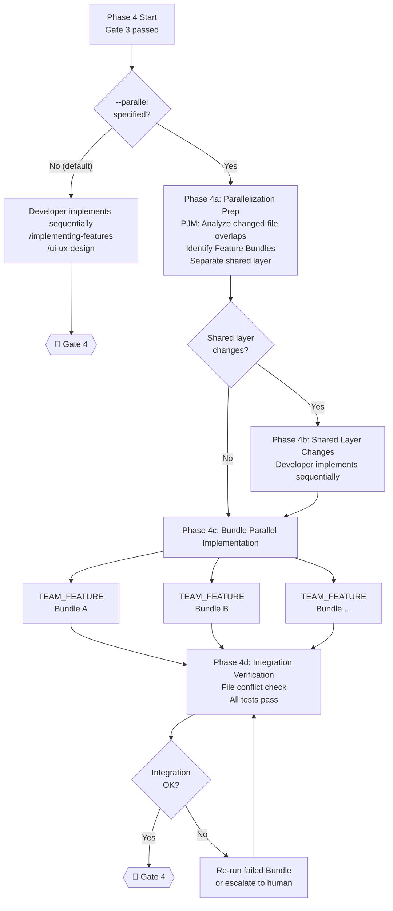

# Team Template Usage Guide

## Overview

Provides 5 specialized team templates for different project activity phases.
Each team is mapped to the 11 skills under `.claude/skills/`.

## Quick Start

**Full lifecycle (recommended):**

```text
.claude/teams/TEAM_PJM.md input/requirements/REQ_001.md
```

**Specific phase only:**

```text
.claude/teams/TEAM_FEATURE.md output/tasks/TASK_auth.md
```

## Team List

| Template | Purpose | Members | Skill Coverage |
| --- | --- | --- | --- |
| **`TEAM_PJM.md`** | **Full lifecycle management** | **6** | **11/11 (all skills)** |
| `TEAM_FEATURE.md` | Feature development / bug fixes | 5 | 5 |
| `TEAM_QA.md` | Quality assurance / audit | 5 | 5 |
| `TEAM_PLANNING.md` | Design phase | 4 | 3 |
| `TEAM_REFACTOR.md` | Refactoring | 4 | 5 |

### Team Selection Guide

| What You Want to Do | Recommended Team |
| --- | --- |
| Handle everything from requirement notes | **`TEAM_PJM.md`** |
| Implement a new feature | `TEAM_FEATURE.md` |
| Fix a bug | `TEAM_FEATURE.md` |
| Create PRD and design docs | `TEAM_PLANNING.md` |
| Quality check before PR | `TEAM_QA.md` |
| Security and legal audit | `TEAM_QA.md` |
| Improve code structure | `TEAM_REFACTOR.md` |

## Full Workflow Overview (PJM Team)

```text
Human                       AI (PJM Team)                    Human
─────                       ─────────────                    ─────

Place requirement           Phase 1: Requirements Analysis
notes in input/  ──────────▶  Analyst: /prd
                              ▶ output/prd/             ───▶ Review
                            🚏 Gate 1                   ◀── Approve

                            Phase 2: Architecture Design
                              Analyst: /architecture
                              ▶ output/design/           ───▶ Review
                            🚏 Gate 2                   ◀── Approve

                            Phase 3: Task Breakdown
                              Planner: /plan
                              ▶ output/tasks/            ───▶ Review
                            🚏 Gate 3                   ◀── Approve

                            Phase 4: Implementation
                              Sequential: Developer implements sequentially
                                Developer: /implementing-features
                                           /ui-ux-design
                              Parallel(--parallel): TEAM_FEATURE × N
                                PJM: Identify Bundles → Sequential shared layer
                                    → Parallel TEAM_FEATURE launch → Integration check
                            🚏 Gate 4 (Tests & Coverage)

                            Phase 5: Verification (Parallel)
                              Reviewer: /code-review
                                        /security-scan
                                        /legal-check
                              Tester:   /e2e-testing
                                        /performance
                              ▶ output/reports/          ───▶ Review
                            🚏 Gate 5                   ◀── Approve

                            Phase 6: Completion ─────────▶ Final Report
```

### Workflow Diagram (mermaid)



### Phase 4 Detail: Sequential vs Parallel Mode



## Input/Output Structure

```text
project-root/
├── input/                         Human-created (read-only for AI)
│   ├── README.md                  Usage guide
│   └── requirements/              Requirement notes
│       ├── REQ_001_xxx.md
│       └── REQ_002_xxx.md
│
├── output/                        AI-generated (human reviews)
│   ├── README.md                  Deliverables description
│   ├── prd/                       PRDs (Phase 1)
│   ├── design/                    Architecture docs (Phase 2)
│   ├── tasks/                     Task breakdowns (Phase 3)
│   └── reports/                   Quality reports (Phase 5)
│       ├── review/                  Code reviews
│       ├── test/                    Test results
│       ├── security/                Security scans
│       └── legal/                   Legal checks
│
├── project-config.md              Human-authored config file
├── .claude/teams/                 Team definitions
└── .claude/skills/                Skill definitions (11)
```

### Directory Roles

| Directory | Who Writes | Who Reads | Content |
| --- | --- | --- | --- |
| `input/requirements/` | Human | AI | Requirement notes/memos |
| `output/prd/` | AI | Human | PRDs |
| `output/design/` | AI | Human | Architecture design docs |
| `output/tasks/` | AI | Human + AI | Task breakdowns / implementation instructions |
| `output/reports/review/` | AI | Human | Code review reports |
| `output/reports/test/` | AI | Human | Test result reports |
| `output/reports/security/` | AI | Human | Security scan reports |
| `output/reports/legal/` | AI | Human | Legal check reports |
| `project-config.md` | Human + AI | AI | Project configuration |

## Skill Coverage

Mapping of all 11 skills across teams:

| Skill | PJM | Feature | QA | Planning | Refactor |
| --- | :---: | :---: | :---: | :---: | :---: |
| `plan` | Planner | PL | — | Planner | PL |
| `implementing-features` | Developer | Developer | — | — | Refactorer |
| `ui-ux-design` | Developer | UI/UX | — | — | — |
| `code-review` | Reviewer | Reviewer | Reviewer | — | Reviewer |
| `e2e-testing` | Tester | Tester | Tester | — | Tester |
| `performance` | Tester | — | Perf Eng | — | — |
| `refactoring` | Developer | — | — | — | Refactorer |
| `security-scan` | Reviewer | — | Security | — | — |
| `legal-check` | Reviewer | — | Security | — | — |
| `prd` | Analyst | — | — | Analyst | — |
| `architecture` | Analyst | — | — | Architect | — |

## Invocation Patterns

All teams: Arguments (file path or instruction) are optional. When omitted, the PL interactively identifies the target.

### PJM Team

```text
.claude/teams/TEAM_PJM.md input/requirements/REQ_001.md
.claude/teams/TEAM_PJM.md input/requirements/REQ_001.md --auto
.claude/teams/TEAM_PJM.md input/requirements/REQ_001.md --parallel
.claude/teams/TEAM_PJM.md input/requirements/REQ_001.md --auto --parallel
.claude/teams/TEAM_PJM.md Start from Phase 3. PRD and design docs already in output/
.claude/teams/TEAM_PJM.md Implementation done. Run Phase 5 only --auto
```

`--auto`: Autonomous mode. Delegates gate approvals to PJM, presenting only the final report to human.
`--parallel`: Parallel implementation mode. In Phase 4, separates independent task groups into Feature Bundles and launches multiple TEAM_FEATURE instances in parallel.

### Feature Development Team

```text
.claude/teams/TEAM_FEATURE.md output/tasks/TASK_auth.md
```

### Planning Team

```text
.claude/teams/TEAM_PLANNING.md input/requirements/REQ_001.md
```

### Quality Assurance Team

```text
.claude/teams/TEAM_QA.md src/features/assignment/
```

### Refactoring Team

```text
.claude/teams/TEAM_REFACTOR.md src/features/assignment/
```

## Customization

Edit team templates directly or copy and save with a different name.

- Adding/removing roles: Edit the team composition table and each role's responsibility section
- Changing skills: Modify each role's skills (specify skill names under `.claude/skills/`)
- Workflow changes: Edit workflow and dependency rules
- Adding/removing gates: Edit gate points in the phase workflow
