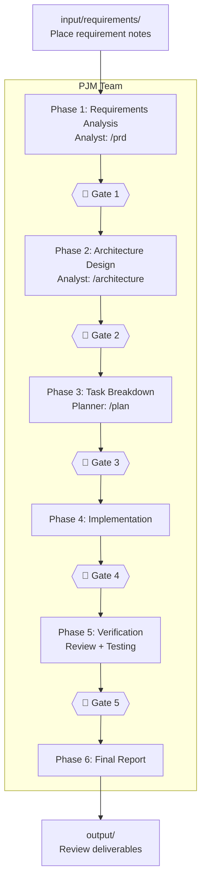
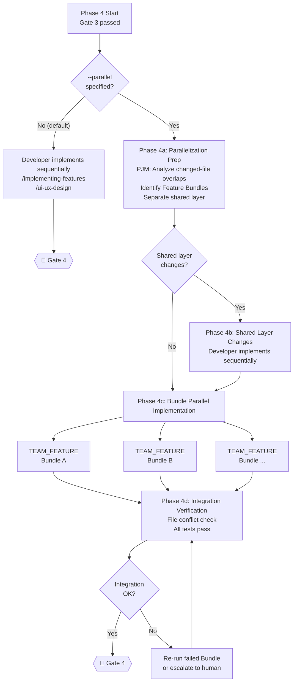

# Team Template Usage Guide

## Overview

Provides 6 specialized team templates for different project activity phases.
Each team is mapped to the skills under `.claude/skills/`.

### Relationship to the official Agent Teams feature

`TEAM_*.md` files are **prompt-level orchestration definitions**, a different layer
from Claude Code's official Agent Teams feature. The two are meant to be combined.

| | `TEAM_*.md` (this template) | Official Agent Teams |
| --- | --- | --- |
| What it is | Markdown role definitions and phase procedures | Multiple Claude Code instances |
| How it starts | Point Claude at the file path | Ask for teammates in natural language |
| Context | Main session + subagents | Independent per teammate |
| Enablement | None needed (always available) | Requires `CLAUDE_CODE_EXPERIMENTAL_AGENT_TEAMS=1` |
| Cost | Low to medium | High (a separate instance per teammate) |

- **`TEAM_*.md` alone is the default** and is usually enough. For sequential phases or
  work that edits the same files, it is more efficient than official Agent Teams
- Add official Agent Teams only where **parallel exploration genuinely pays off**:
  debugging competing hypotheses, cross-layer concurrent implementation, multi-angle review
- When combining, `teammateMode` in `settings.local.json` selects where teammates are
  **displayed** (`in-process` / `auto` / `tmux` / `iterm2`). `worktree` is not a teammateMode value
- With official Agent Teams enabled, a subagent Claude names launches as a teammate, so a
  team can form even when you did not ask for one
- To apply quality gates to teammates as well, use the `TeammateIdle` / `TaskCompleted` hooks

## Quick Start

**Full lifecycle (recommended):**

```text
.claude/teams/TEAM_PJM.md input/requirements/REQ_001.md
```

**Specific phase only:**

```text
.claude/teams/TEAM_FEATURE.md output/tasks/TASK_auth.md
```

## Team List (with topology)

`topology` is a parallelism metadata field inspired by claude-flow's orchestration taxonomy:

- **hierarchical**: PL → member, one-direction (sequential, coordination-heavy)
- **mesh**: cross-review among members (parallel, consensus-heavy)
- **star**: one central hub radiating to others (distributed dispatch)

| Template | Purpose | Members | Skill Coverage | topology |
| --- | --- | --- | --- | -------- |
| **`TEAM_PJM.md`** | **Full lifecycle management** | **6** | **13 (all team-routed skills)** | hierarchical |
| `TEAM_FEATURE.md` | Feature development / bug fixes | 5 | 5 | hierarchical |
| `TEAM_QA.md` | Quality assurance / audit | 5 | 5 | mesh |
| `TEAM_PLANNING.md` | Design phase | 4 | 4 | mesh |
| `TEAM_DESIGN.md` | Design system integration | 4 | 3 | star |
| `TEAM_REFACTOR.md` | Refactoring | 4 | 5 | star |

### Team Selection Guide

| What You Want to Do | Recommended Team |
| --- | --- |
| Handle everything from requirement notes | **`TEAM_PJM.md`** |
| Implement a new feature | `TEAM_FEATURE.md` |
| Fix a bug | `TEAM_FEATURE.md` |
| Create PRD and design docs | `TEAM_PLANNING.md` |
| Quality check before PR | `TEAM_QA.md` |
| Security and legal audit | `TEAM_QA.md` |
| Build / audit design system | `TEAM_DESIGN.md` |
| Cross-screen UI consistency audit | `TEAM_DESIGN.md` |
| Improve code structure | `TEAM_REFACTOR.md` |

## Full Workflow Overview (PJM Team)

```text
Human                       AI (PJM Team)                    Human
─────                       ─────────────                    ─────

Place requirement           Phase 1: Requirements Analysis
notes in input/  ──────────▶  Analyst: /prd
                              ▶ output/prd/             ───▶ Review
                            🚏 Gate 1                   ◀── Approve

                            Phase 2: Architecture Design
                              Analyst: /architecture
                              ▶ output/design/           ───▶ Review
                            🚏 Gate 2                   ◀── Approve

                            Phase 3: Task Breakdown
                              Planner: /plan
                              ▶ output/tasks/            ───▶ Review
                            🚏 Gate 3                   ◀── Approve

                            Phase 4: Implementation
                              Sequential: Developer implements sequentially
                                Developer: /implementing-features
                                           /ui-ux-design
                              Parallel(--parallel): TEAM_FEATURE × N
                                PJM: Identify Bundles → Sequential shared layer
                                    → Parallel TEAM_FEATURE launch → Integration check
                            🚏 Gate 4 (Tests & Coverage)

                            Phase 5: Verification (Parallel)
                              Reviewer: /code-review
                                        /security-scan
                                        /legal-check
                              Tester:   /e2e-testing
                                        /performance
                              ▶ output/reports/          ───▶ Review
                            🚏 Gate 5                   ◀── Approve

                            Phase 6: Completion ─────────▶ Final Report
```

### Workflow Diagram (mermaid)


```mermaid
flowchart TD
    A["input/requirements/\nPlace requirement notes"] --> P1

    subgraph PJM["PJM Team"]
        P1["Phase 1: Requirements Analysis\nAnalyst: /prd"]
        G1{{"🚏 Gate 1"}}
        P2["Phase 2: Architecture Design\nAnalyst: /architecture"]
        G2{{"🚏 Gate 2"}}
        P3["Phase 3: Task Breakdown\nPlanner: /plan"]
        G3{{"🚏 Gate 3"}}
        P4["Phase 4: Implementation"]
        G4{{"🚏 Gate 4"}}
        P5["Phase 5: Verification\nReview + Testing"]
        G5{{"🚏 Gate 5"}}
        P6["Phase 6: Final Report"]

        P1 --> G1 --> P2 --> G2 --> P3 --> G3 --> P4 --> G4 --> P5 --> G5 --> P6
    end

    P6 --> Z["output/\nReview deliverables"]
```

### Phase 4 Detail: Sequential vs Parallel Mode


```mermaid
flowchart TD
    Start["Phase 4 Start\nGate 3 passed"]
    Check{"--parallel\nspecified?"}

    Start --> Check

    %% Sequential mode
    Check -- "No (default)" --> SEQ["Developer implements sequentially\n/implementing-features\n/ui-ux-design"]
    SEQ --> G4A{{"🚏 Gate 4"}}

    %% Parallel mode
    Check -- "Yes" --> P4A["Phase 4a: Parallelization Prep\nPJM: Analyze changed-file overlaps\nIdentify Feature Bundles\nSeparate shared layer"]
    P4A --> HasShared{"Shared layer\nchanges?"}

    HasShared -- "Yes" --> P4B["Phase 4b: Shared Layer Changes\nDeveloper implements sequentially"]
    HasShared -- "No" --> P4C
    P4B --> P4C

    P4C["Phase 4c: Bundle Parallel Implementation"]

    P4C --> F1["TEAM_FEATURE\nBundle A"]
    P4C --> F2["TEAM_FEATURE\nBundle B"]
    P4C --> F3["TEAM_FEATURE\nBundle ..."]

    F1 --> P4D["Phase 4d: Integration Verification\nFile conflict check\nAll tests pass"]
    F2 --> P4D
    F3 --> P4D

    P4D --> IntOK{"Integration\nOK?"}
    IntOK -- "Yes" --> G4B{{"🚏 Gate 4"}}
    IntOK -- "No" --> Retry["Re-run failed Bundle\nor escalate to human"]
    Retry --> P4D
```

## Input/Output Structure

```text
project-root/
├── input/                         Human-created (read-only for AI)
│   ├── README.md                  Usage guide
│   └── requirements/              Requirement notes
│       ├── REQ_001_xxx.md
│       └── REQ_002_xxx.md
│
├── output/                        AI-generated (human reviews)
│   ├── README.md                  Deliverables description
│   ├── prd/                       PRDs (Phase 1)
│   ├── design/                    Architecture docs (Phase 2)
│   ├── tasks/                     Task breakdowns (Phase 3)
│   └── reports/                   Quality reports (Phase 5)
│       ├── review/                  Code reviews
│       ├── test/                    Test results
│       ├── security/                Security scans
│       └── legal/                   Legal checks
│
├── project-config.md              Human-authored config file
├── .claude/teams/                 Team definitions
└── .claude/skills/                Skill definitions
```

### Directory Roles

| Directory | Who Writes | Who Reads | Content |
| --- | --- | --- | --- |
| `input/requirements/` | Human | AI | Requirement notes/memos |
| `output/prd/` | AI | Human | PRDs |
| `output/design/` | AI | Human | Architecture design docs |
| `output/tasks/` | AI | Human + AI | Task breakdowns / implementation instructions |
| `output/reports/review/` | AI | Human | Code review reports |
| `output/reports/test/` | AI | Human | Test result reports |
| `output/reports/security/` | AI | Human | Security scan reports |
| `output/reports/legal/` | AI | Human | Legal check reports |
| `project-config.md` | Human + AI | AI | Project configuration |

## Skill Coverage

Mapping of team-routed skills across teams:

| Skill | PJM | Feature | QA | Planning | Design | Refactor |
| --- | :---: | :---: | :---: | :---: | :---: | :---: |
| `brainstorm` | Analyst (cond.) | — | — | Analyst (cond.) | — | — |
| `plan` | Planner | PL | — | Planner | — | PL |
| `implementing-features` | Developer | Developer | — | — | — | Refactorer |
| `ui-ux-design` | Developer | UI/UX | — | — | UI/UX | — |
| `hig-compliance` | Reviewer | — | — | — | — | — |
| `design-system-audit` | — | — | — | — | DS Eng | — |
| `code-review` | Reviewer | Reviewer | Reviewer | — | Reviewer | Reviewer |
| `e2e-testing` | Tester | Tester | Tester | — | — | Tester |
| `performance` | Tester | — | Perf Eng | — | — | — |
| `refactoring` | Developer | — | — | — | — | Refactorer |
| `security-scan` | Reviewer | — | Security | — | — | — |
| `legal-check` | Reviewer | — | Security | — | — | — |
| `prd` | Analyst | — | — | Analyst | — | — |
| `architecture` | Analyst | — | — | Architect | — | — |

### Auxiliary skills (not mapped to any team)

These skills are designed to be called standalone, outside team contexts:

- **`/adr`**: Records architecture decisions. Called on-demand when a judgment call is made
- **`/review-fix`**: Auto-fixes CodeRabbit / Copilot review comments on a given PR number

## Subagent Dispatch Guide

Team members can delegate to the following subagents on demand (see `@.claude/agents/README.md`).

| Agent | PJM | Feature | QA | Planning | Design | Refactor |
| ----- | :---: | :---: | :---: | :---: | :---: | :---: |
| `explorer` | Analyst/Planner | PL | Reviewer | Planner | UI/UX | Refactorer |
| `researcher` | Analyst | Developer (new dependency) | Security | Architect | DS Eng | — |
| `planner` | Planner | — | — | Planner | — | — |
| `security-reviewer` | Reviewer | — | Security | — | — | — |
| `performance-analyst` | Tester | — | Perf Eng | — | — | — |
| `doc-synchronizer` | Developer | Developer | — | — | — | Refactorer |
| `doc-writer` | Analyst/Reviewer | — | Reviewer | Analyst | — | — |
| `test-writer` | Developer/Tester | Developer | Tester | — | — | Tester |

### Typical dispatch examples

- **PJM Phase 2 (Architecture design)**: Analyst calls `researcher` to confirm the latest spec of the target library → runs `/architecture`
- **PJM Phase 5 (Verification)**: Reviewer calls `doc-writer` to author a consolidated summary report under `output/reports/` (aggregating multiple skill outputs)
- **TEAM_FEATURE during implementation**: Developer calls `researcher` to confirm the official spec of an unfamiliar dependency before touching it (avoid wheel reinvention)
- **TEAM_QA**: Security role combines `security-reviewer` agent + `researcher` (latest CVE intelligence) for audits
- **TEAM_PLANNING**: Architect uses `researcher` to gather comparison data on candidate frameworks → grounding for design decisions

Agents and teams live on different layers (the three-layer separation principle). Team members dispatch agents on demand for single-shot work; agents must not launch teams (no circular invocation).

## Invocation Patterns

All teams: Arguments (file path or instruction) are optional. When omitted, the PL interactively identifies the target.

### PJM Team

```text
.claude/teams/TEAM_PJM.md input/requirements/REQ_001.md
.claude/teams/TEAM_PJM.md input/requirements/REQ_001.md --auto
.claude/teams/TEAM_PJM.md input/requirements/REQ_001.md --parallel
.claude/teams/TEAM_PJM.md input/requirements/REQ_001.md --auto --parallel
.claude/teams/TEAM_PJM.md Start from Phase 3. PRD and design docs already in output/
.claude/teams/TEAM_PJM.md Implementation done. Run Phase 5 only --auto
```

`--auto`: Autonomous mode. Delegates gate approvals to PJM, presenting only the final report to human.
`--parallel`: Parallel implementation mode. In Phase 4, separates independent task groups into Feature Bundles and launches multiple TEAM_FEATURE instances in parallel.

### Feature Development Team

```text
.claude/teams/TEAM_FEATURE.md output/tasks/TASK_auth.md
```

### Planning Team

```text
.claude/teams/TEAM_PLANNING.md input/requirements/REQ_001.md
```

### Quality Assurance Team

```text
.claude/teams/TEAM_QA.md src/features/assignment/
```

### Design System Team

```text
.claude/teams/TEAM_DESIGN.md Audit system-wide design consistency and apply fixes
.claude/teams/TEAM_DESIGN.md Align src/features/touring/ UI with the design system
```

### Refactoring Team

```text
.claude/teams/TEAM_REFACTOR.md src/features/assignment/
```

## Customization

Edit team templates directly or copy and save with a different name.

- Adding/removing roles: Edit the team composition table and each role's responsibility section
- Changing skills: Modify each role's skills (specify skill names under `.claude/skills/`)
- Workflow changes: Edit workflow and dependency rules
- Adding/removing gates: Edit gate points in the phase workflow
