# Project Configuration

> **Project parameter file filled in by humans.**
> Consolidates technology choices, quality standards, policies, and other "decisions that humans should make."
>
> **AI-managed areas (not included in this file):**
> - Routing definitions → AI auto-generates in `docs/project.md`
> - Store list → AI auto-generates in `docs/project.md`
> - Data model/schema → AI auto-generates in `docs/data-model.md`
>
> **AI maintenance:**
> Skills (`/implementing-features`, `/plan`, etc.) update Section 11 (Known Pitfalls)
> and Section 2 (Tech Stack) as needed during design and implementation,
> maintaining consistency with `docs/`.

---

## Section-by-Section Adoption Guide

**You don't need to fill in everything at once.** Add sections incrementally based on the skills you want to use.

```mermaid
flowchart LR
    subgraph MINIMAL["Minimal (S1+S2+S3)"]
        S1["S1 Project Basics"]
        S2["S2 Tech Stack"]
        S3["S3 Commands"]
    end

    subgraph RECOMMEND["Recommended (+S4)"]
        S4["S4 Architecture"]
    end

    subgraph FULL["Full (+remaining)"]
        S5["S5 Data Persistence"]
        S6["S6 Quality Standards"]
        S7["S7 Design System"]
        S8["S8 E2E Test Environment"]
        S9["S9 Git Policy"]
        S10["S10 Security Policy"]
        S11["S11 Known Pitfalls"]
        S12["S12 Plugin Config"]
    end

    MINIMAL -- "+add S4" --> RECOMMEND
    RECOMMEND -- "as needed" --> FULL
```



| Step | Sections to Fill | Skills & Features Unlocked |
| --- | --- | --- |
| **Minimal** | S1 + S2 + S3 | `/prd`, `/plan`, `/code-review` — design, analysis, review |
| **Recommended** | + S4 | `/architecture`, `/implementing-features`, `/refactoring`, all teams — implementation, refactoring |
| **Full** | Add sections as needed | `/security-scan`(S10), `/legal-check`, `/e2e-testing`(S8), `/performance`, etc. |

> **S6 (Quality Standards)** controls TDD, coverage targets, and quality gate activation. It's not a prerequisite for any skill — everything works with it blank — but filling it in enables automated quality management.
>
> **Blank sections** are simply skipped during skill execution. They do not cause errors.
>
> **Note**: the "minimal/recommended/full" guidance above is about *which project-config.md sections to fill in*.
> Which skills/agents/hooks/teams get physically bundled under `.claude/` is controlled by a
> **separate, independent axis**: `setup.sh --profile minimal|standard|full`. The names are similar but
> the two axes are unrelated (e.g. you can install with `setup.sh --profile minimal` and still fill in
> project-config.md all the way to full).

---

## 1. Project Basics <!-- Required -->

| Field | Value |
| --- | --- |
| Project Name | <!-- Enter project name --> |
| Description | <!-- Enter project description --> |
| Language | en |
| Node.js Requirement | <!-- e.g., 20+ --> |

---

## 2. Tech Stack <!-- Required -->

<!-- Enter the technologies used in the project. AI will append version changes during development. -->

| Category | Technology |
| --- | --- |
| Framework | <!-- e.g., React 19, TypeScript 5.x, Vite 7 --> |
| Styling | <!-- e.g., Tailwind CSS 4, shadcn/ui --> |
| State Management | <!-- e.g., Zustand 5 --> |
| Validation | <!-- e.g., Zod 3.x --> |
| Routing | <!-- e.g., React Router DOM 7 --> |
| Icons | <!-- e.g., lucide-react --> |
| Code Quality | <!-- e.g., Biome 2.x / ESLint 9 --> |
| Dependency Direction Check | <!-- e.g., dependency-cruiser 17 / None --> |
| Git Hooks | <!-- e.g., husky 9, lint-staged 16 / None --> |
| Testing | <!-- e.g., Vitest 4, Playwright 1.x --> |

---

## 3. Commands <!-- Required -->

<!-- Enter the project's development, test, and build commands -->
<!-- Replace `<pm>` with the project's package manager -->

**Package manager reference:**

| Tool | Run Command | Install | Notes |
| --- | --- | --- | --- |
| npm | `npm run` | `npm install` | Node.js standard |
| yarn | `yarn` | `yarn` | yarn can omit `run` |
| pnpm | `pnpm run` | `pnpm install` | Disk-efficient |
| bun | `bun run` | `bun install` | Fast alternative runtime |

```bash
<pm> run dev              # Development server
<pm> run build            # Production build
<pm> run lint             # Lint
<pm> run test             # Test
<pm> run test:run         # Run tests once
<pm> run test:coverage    # Test with coverage
# <pm> run e2e            # E2E tests (if applicable)
# <pm> run depcruise      # Dependency direction check (if applicable)
```

---

## 4. Architecture <!-- Recommended -->

### 4.1 Pattern

<!-- Select a pattern based on your project scale. Use the guide below as reference. -->

**Pattern selection guide:**

| Scale | Team | Recommended Pattern | Characteristics |
| --- | --- | --- | --- |
| MVP / Small | 1-2 people | Simple | Flat structure with low learning curve. Quick to set up |
| Medium | 2-5 people | Modular / Feature-Based | Isolated by feature. Flexible without being as strict as FSD |
| Large / Long-term | 5+ people | FSD (Feature-Sliced Design) | Strict layer constraints. Maintains order in large teams |
| Next.js / Nuxt | --- | Pages-Based | Follows file-system routing conventions |

Selected pattern: <!-- e.g., Simple / Modular / FSD / Pages-Based -->

### 4.2 Path Aliases

<!-- e.g., `@/` → `src/` -->

### 4.3 Directory Structure (Overview)

<!-- Enter the source code directory structure. Details will be generated by AI in docs/architecture.md. -->
<!-- Fill in according to the pattern selected in 4.1. See the collapsible section below for pattern-specific examples. -->

```text
src/
├── <!-- Enter your project's directory structure -->
```

### 4.4 Dependency Direction Rules

<!-- Enter the project's dependency direction rules. Include the detection command. -->
<!-- Fill in according to the pattern selected in 4.1. See the collapsible section below for pattern-specific examples. -->

- <!-- Enter dependency direction rules -->
- Circular dependencies: Prohibited
- Detection command: <!-- e.g., `npx depcruise src --config` / None -->

---

<details>
<summary>Directory structure and dependency direction rule examples by pattern (click to expand)</summary>

#### A. Simple — For MVPs and small projects

Flat layout with `components/hooks/utils`. Migrate to Modular when features grow.

```text
src/
├── main.tsx               # Entry point
├── App.tsx                # Routing definitions
├── components/            # UI components
├── hooks/                 # Custom hooks
├── utils/                 # Utility functions
├── types/                 # Type definitions
├── stores/                # State management
└── test/                  # Test setup
```

Dependency direction rule examples:
- `utils` → `components`: Prohibited (utils should contain pure functions only)
- `stores` → `components`: Prohibited
- Circular dependencies: Prohibited

#### B. Modular / Feature-Based — For medium projects

Self-contained module structure organized by feature. Flexible without being as strict as FSD.

```text
src/
├── main.tsx               # Entry point
├── App.tsx                # Routing definitions
├── features/              # Feature modules (each feature is self-contained)
│   ├── auth/              #   Authentication (components, hooks, utils, types)
│   ├── dashboard/         #   Dashboard
│   └── settings/          #   Settings
├── shared/                # Cross-feature shared code
│   ├── components/        #   Shared UI components
│   ├── hooks/             #   Shared hooks
│   └── utils/             #   Shared utilities
├── stores/                # Global state management
└── test/                  # Test setup
```

Dependency direction rule examples:
- `features/X` → `features/Y` direct dependency: Prohibited (coordinate via shared)
- `shared` → `features`: Prohibited
- `stores` → `features`: Prohibited
- Circular dependencies: Prohibited

#### C. FSD (Feature-Sliced Design) — For large-scale / long-term projects

Strict layer constraints and dependency direction control. Suitable for maintaining order in large teams.

```text
src/
├── main.tsx               # Entry point
├── App.tsx                # Routing definitions
├── features/              # Feature modules
├── shared/                # Shared layer
├── infrastructure/        # Infrastructure layer (API communication / external services)
├── stores/                # State management
├── test/                  # Test setup
└── lib/                   # General-purpose utilities
```

Dependency direction rule examples:
- `features/X` → `features/Y` direct dependency: Prohibited (coordinate via shared)
- `shared` → `features`: Prohibited
- `infrastructure` → `features`: Prohibited
- `stores` → `features`: Prohibited
- Circular dependencies: Prohibited
- Detection command: `npx depcruise src --config`

#### D. Pages-Based — For Next.js App Router / Nuxt

File-system-based routing structure. Follows framework conventions.

```text
src/  # or app/ (Next.js App Router)
├── app/                   # Routing (App Router)
│   ├── layout.tsx         #   Root layout
│   ├── page.tsx           #   Top page
│   ├── dashboard/         #   /dashboard
│   └── settings/          #   /settings
├── components/            # UI components
├── hooks/                 # Custom hooks (use-client)
├── lib/                   # Utilities / API functions
├── stores/                # Client state management
└── types/                 # Type definitions
```

Dependency direction rule examples:
- Server Components → Client Components: Allowed (reverse is prohibited)
- `lib` → `components`: Prohibited
- `stores` → `components`: Prohibited
- Circular dependencies: Prohibited

</details>

---

## 5. Data Persistence <!-- Optional -->

| Field | Value |
| --- | --- |
| Strategy | <!-- e.g., localStorage / IndexedDB / REST API --> |
| Storage Key | <!-- e.g., `app-data` (business data) --> |
| Migration Policy | <!-- e.g., optional + default values for backward compatibility --> |

---

## 6. Quality Standards <!-- Recommended -->

| Field | Value |
| --- | --- |
| Test Coverage Target | <!-- e.g., 80% --> |
| TDD | <!-- yes / no --> |
| Quality Gates | <!-- yes / no --> |
| Tool Output Directory | `testreport/` |
| Summary Output Directory | `output/reports/` |

### 6.1 Report Output Structure

Reports are separated into two directories by purpose:

- `testreport/` --- Raw data generated by tools (HTML/JSON/LCOV, etc.). Add to `.gitignore`
- `output/reports/` --- Markdown summaries for human review. Managed in Git

```text
testreport/                    <- Direct tool output (.gitignore target)
├── coverage/              # Unit test coverage (HTML/LCOV)
├── e2e/                   # Playwright E2E test reports and traces
└── security/              # Security scan reports (JSON/HTML)

output/reports/                <- Human-readable summaries (Git-managed)
├── review/                # Code review results
├── test/                  # Test result summaries
├── security/              # Security scan summaries
└── legal/                 # Legal check results
```

---

## 7. Design System <!-- Recommended -->

| Field | Value |
| --- | --- |
| Reference Design System | <!-- URL or "None" --> |
| UI Component Library | <!-- e.g., shadcn/ui (Radix UI) --> |
| Icon Library | <!-- e.g., Lucide Icons --> |
| Accessibility Standard | <!-- e.g., WCAG 2.1 AA --> |
| Color Token Definition File | <!-- e.g., src/index.css --> |

---

## 8. E2E Testing Environment <!-- Optional -->

| Field | Value |
| --- | --- |
| Browser | <!-- e.g., Chromium --> |
| Base URL | <!-- e.g., http://localhost:5173 --> |
| Test File Location | <!-- e.g., e2e/ --> |
| Test Data Injection Method | <!-- e.g., Direct localStorage injection --> |

---

## 9. Git Policy <!-- Optional -->

| Field | Value |
| --- | --- |
| pre-commit | <!-- e.g., lint-staged (Biome check) --> |
| pre-push | <!-- e.g., lint + type check + test --> |
| `--no-verify` | Prohibited |
| `--force` | Prohibited in principle |

---

## 10. Security Policy <!-- Optional -->

<!-- Enter the project's security policy -->

- All user input must be validated
- Dependency vulnerabilities should be checked regularly
- <!-- Add other project-specific policies -->

### Harness-side safety mechanisms (provided by this template)

- **3-layer defense**: hooks (Layer 1) → deny rules (Layer 2) → allow rules (Layer 3). Details in `@.claude/guardrails.md`
- **Self-SAST**: `scan-harness.sh` (PreToolUse: Skill) detects secret leaks / constitution drift / weakened local denies
- **Inviolable principles**: 7 principles in `@constitution.md`, hash-monitored via `.claude/.constitution.sha256`
- **Hook profile**: `BLUEPRINT_HOOK_PROFILE=minimal|standard|strict` toggles inspection strictness
- **High-risk skill blocking**: `deploy*` skills are blocked at all times by `scan-harness.sh` (only `minimal` profile lets them through)
- **3-tier permission operation**: allowlist / auto / sandbox usage detailed in `@.claude/permissions-guide.md`

---

## 11. Project-Specific Notes <!-- Recommended -->

> This section is updated by AI as issues are discovered during development.
> Humans may also enter initial values.

### Known Pitfalls

<!-- AI appends issues and notes discovered during development. Enter any known issues as initial values. -->

| Issue | Cause | Mitigation |
| --- | --- | --- |
| <!-- Issue summary --> | <!-- Root cause --> | <!-- Mitigation --> |

### Framework-Specific Patterns

<!-- Enter notes specific to the frameworks/libraries in use. AI will also append entries. -->

---

## 12. Claude Code Plugin Settings <!-- Optional -->

<!-- Enter the plugins to use. Remove any that are not needed. -->

| Plugin | Enabled | Purpose |
| --- | --- | --- |
| context7 | yes | Library documentation reference |
| playwright | yes | E2E test execution and debugging |
| draw.io | yes | Architecture diagrams and flow charts |
| pr-review-toolkit | yes | GitHub PR integration |
| sentry | no | Production error investigation (enable as needed) |

---

## 13. Model Selection Strategy <!-- Recommended -->

> Which Claude model — Opus / Sonnet / Haiku — to use for each skill / team / agent.
> Makes the cost / quality / speed trade-off explicit. If unspecified, falls back to the session default.

### 13.1 Tier definitions

| Tier | Model (as of 2026-04) | Use | Cost level |
| ---- | --------------------- | --- | ---------- |
| **Critical** | `claude-opus-4-7` | Architecture decisions, security audits, complex refactors | High |
| **Complex** | `claude-sonnet-4-6` | Design, implementation, code review, E2E authoring | Medium (recommended) |
| **Operational** | `claude-haiku-4-5-20251001` | Exploration, doc sync, lightweight repetitive work | Low |

> **Model ID notes**: Opus 4.7 and Sonnet 4.6 are alias IDs (Anthropic auto-updates them to the latest revision). Haiku uses a date-pinned version ID. Since aliases can be retired, production deployments should consider pinning to a dated ID. Check the exact current IDs on the [Anthropic Console Models page](https://console.anthropic.com/settings/models).

Older models (`claude-opus-4`, `claude-sonnet-3-5`, `claude-haiku-3-5`, etc.) are discouraged in this template.

### 13.2 Skill × model recommendations

| Skill | Recommended tier | Rationale |
| ----- | ---------------- | --------- |
| `/prd` | Complex | Requirements structuring; moderate reasoning |
| `/architecture` | Critical | Design mistakes ripple downstream |
| `/plan` | Complex | Task breakdown, dependency mapping |
| `/implementing-features` | Complex | Main TDD implementation workload |
| `/ui-ux-design` | Complex | Design-system alignment judgment |
| `/hig-compliance` | Complex | Cross-screen consistency |
| `/design-system-audit` | Complex | Ratio / token calculations |
| `/code-review` | Critical | Finding quality drives downstream quality |
| `/security-scan` | Critical | Missed vulnerabilities have large impact |
| `/legal-check` | Complex | License / GDPR text matching |
| `/e2e-testing` | Complex | Page Object design, stability |
| `/performance` | Complex | Measurement data interpretation |
| `/refactoring` | Critical | Structural change risk management |
| `/adr` | Operational | Templated record keeping |
| `/review-fix` | Complex | Must correctly understand review intent |

### 13.3 Team × model recommendations

| Team | PJM | Analyst | Planner | Developer | Reviewer | Tester |
| ---- | --- | ------- | ------- | --------- | -------- | ------ |
| `TEAM_PJM` | Critical | Complex | Complex | Complex | Critical | Complex |
| `TEAM_FEATURE` | — | — | Complex | Complex | Complex | Complex |
| `TEAM_QA` | — | — | — | — | Critical | Complex |
| `TEAM_PLANNING` | Critical | Complex | Complex | — | — | — |
| `TEAM_DESIGN` | — | Complex | — | Complex | Complex | — |
| `TEAM_REFACTOR` | — | — | Complex | Critical | Complex | Complex |

The PJM (lead) role uses Critical because of the judgment precision required.
Reviewer is Critical since audit misalignment is costly.

### 13.4 Subagent × model recommendations

| Agent | Tier | Rationale |
| ----- | ---- | --------- |
| `explorer` | Operational | Lightweight Grep/Read iteration |
| `planner` | Complex | Impact analysis |
| `security-reviewer` | Critical | Missed vulnerabilities are critical |
| `performance-analyst` | Complex | Measurement data interpretation |
| `doc-synchronizer` | Operational | Deterministic diff updates |
| `test-writer` | Complex | Edge-case coverage |

### 13.5 Cost optimization principles

1. **Use Operational aggressively**: Exploration / sync / templated generation runs fine on Haiku. No need for Opus
2. **Mix tiers in parallel runs**: For `TEAM_PJM --parallel`, don't put everyone on Opus; mix tiers by role
3. **Subagents prefer Haiku**: Single-shot delegation stays lightweight; upgrade to Critical only when needed
4. **Set cost limits on the API key**: See `@.claude/pitfalls.md` #6
5. **Monthly usage review**: Check the Anthropic Console; revise tiers if usage drifts from expectations

### 13.6 Behavior when unspecified

- A skill / agent with omitted frontmatter `model:` inherits the session default
- The tables here are **recommendations** and may be overridden by project needs
- For a personal "always use Opus" preference, set `model` in `~/.claude/settings.json`
