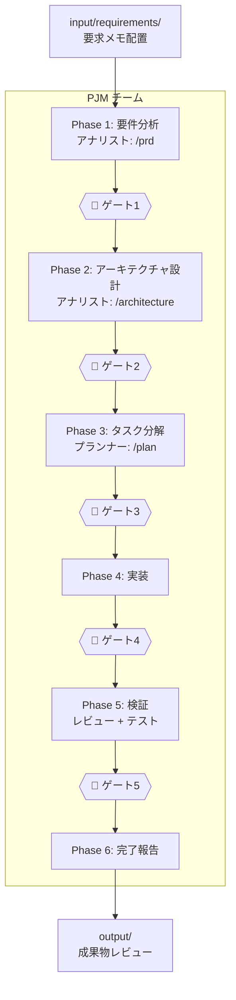
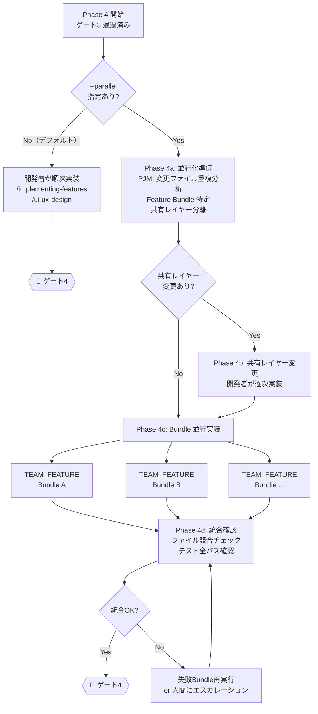

# チームテンプレート利用ガイド

## 概要

プロジェクトの活動フェーズに応じた5つの専門チームテンプレートを提供する。
各チームは`.claude/skills/`配下の11スキルにマッピングされている。

## クイックスタート

**全部おまかせ（推奨）:**

```text
.claude/teams/TEAM_PJM.md input/requirements/REQ_001.md
```

**特定フェーズのみ:**

```text
.claude/teams/TEAM_FEATURE.md output/tasks/TASK_auth.md
```

## チーム一覧

| テンプレート | 用途 | メンバー | カバーするスキル数 |
| --- | --- | --- | --- |
| **`TEAM_PJM.md`** | **フルライフサイクル管理** | **6名** | **11/11（全スキル）** |
| `TEAM_FEATURE.md` | 機能開発・バグ修正 | 5名 | 5 |
| `TEAM_QA.md` | 品質保証・監査 | 5名 | 5 |
| `TEAM_PLANNING.md` | 設計フェーズ | 4名 | 3 |
| `TEAM_REFACTOR.md` | リファクタリング | 4名 | 5 |

### チーム選定ガイド

| やりたいこと | 推奨チーム |
| --- | --- |
| 要求メモから全部やってほしい | **`TEAM_PJM.md`** |
| 新機能を実装したい | `TEAM_FEATURE.md` |
| バグを修正したい | `TEAM_FEATURE.md` |
| PRD・設計書を作りたい | `TEAM_PLANNING.md` |
| PR前に品質チェックしたい | `TEAM_QA.md` |
| セキュリティ・法務監査をしたい | `TEAM_QA.md` |
| コードの構造を改善したい | `TEAM_REFACTOR.md` |

## ワークフロー全体像（PJMチーム）

```text
人間                        AI（PJMチーム）                  人間
────                        ────────────                    ────

input/ に                   Phase 1: 要件分析
要求メモ配置  ─────────────▶  アナリスト: /prd
                              ▶ output/prd/             ───▶ レビュー
                            🚏 ゲート1                  ◀── 承認

                            Phase 2: アーキテクチャ設計
                              アナリスト: /architecture
                              ▶ output/design/           ───▶ レビュー
                            🚏 ゲート2                  ◀── 承認

                            Phase 3: タスク分解
                              プランナー: /plan
                              ▶ output/tasks/            ───▶ レビュー
                            🚏 ゲート3                  ◀── 承認

                            Phase 4: 実装
                              逐次: 開発者が順次実装
                                開発者: /implementing-features
                                        /ui-ux-design
                              並行(--parallel): TEAM_FEATURE × N
                                PJM: Bundle特定 → 共有レイヤー逐次実装
                                    → TEAM_FEATURE 並行起動 → 統合確認
                            🚏 ゲート4（テスト・カバレッジ）

                            Phase 5: 検証（並行）
                              レビュアー: /code-review
                                          /security-scan
                                          /legal-check
                              テスター:   /e2e-testing
                                          /performance
                              ▶ output/reports/          ───▶ レビュー
                            🚏 ゲート5                  ◀── 承認

                            Phase 6: 完了 ──────────────▶ 完了報告
```

### ワークフロー図（mermaid）



### Phase 4 詳細: 逐次モード vs 並行モード



## インプット/アウトプット構造

```text
project-root/
├── input/                         人間が作成（AIは読み取り専用）
│   ├── README.md                  使い方ガイド
│   └── requirements/              要求メモ
│       ├── REQ_001_xxx.md
│       └── REQ_002_xxx.md
│
├── output/                        AIが生成（人間がレビュー）
│   ├── README.md                  成果物の説明
│   ├── prd/                       PRD（Phase 1）
│   ├── design/                    アーキテクチャ設計書（Phase 2）
│   ├── tasks/                     タスク分解（Phase 3）
│   └── reports/                   品質レポート（Phase 5）
│       ├── review/                  コードレビュー
│       ├── test/                    テスト結果
│       ├── security/                セキュリティスキャン
│       └── legal/                   法務チェック
│
├── project-config.md              人間が記入する設定ファイル
├── .claude/teams/                 チーム定義
└── .claude/skills/                スキル定義（11個）
```

### 各ディレクトリの役割

| ディレクトリ | 誰が書くか | 誰が読むか | 内容 |
| --- | --- | --- | --- |
| `input/requirements/` | 人間 | AI | 要求メモ・要件メモ |
| `output/prd/` | AI | 人間 | PRD |
| `output/design/` | AI | 人間 | アーキテクチャ設計書 |
| `output/tasks/` | AI | 人間+AI | タスク分解・実装指示書 |
| `output/reports/review/` | AI | 人間 | コードレビューレポート |
| `output/reports/test/` | AI | 人間 | テスト結果レポート |
| `output/reports/security/` | AI | 人間 | セキュリティスキャンレポート |
| `output/reports/legal/` | AI | 人間 | 法務チェックレポート |
| `project-config.md` | 人間+AI | AI | プロジェクト設定 |

## スキルカバレッジ

全11スキルの各チームへのマッピング:

| スキル | PJM | Feature | QA | Planning | Refactor |
| --- | :---: | :---: | :---: | :---: | :---: |
| `plan` | Planner | PL | — | Planner | PL |
| `implementing-features` | Developer | Developer | — | — | Refactorer |
| `ui-ux-design` | Developer | UI/UX | — | — | — |
| `code-review` | Reviewer | Reviewer | Reviewer | — | Reviewer |
| `e2e-testing` | Tester | Tester | Tester | — | Tester |
| `performance` | Tester | — | Perf Eng | — | — |
| `refactoring` | Developer | — | — | — | Refactorer |
| `security-scan` | Reviewer | — | Security | — | — |
| `legal-check` | Reviewer | — | Security | — | — |
| `prd` | Analyst | — | — | Analyst | — |
| `architecture` | Analyst | — | — | Architect | — |

## 起動パターン

全チーム共通: 引数（ファイルパス or 指示）は省略可能。省略時はPLが対話的に対象を特定する。

### PJMチーム

```text
.claude/teams/TEAM_PJM.md input/requirements/REQ_001.md
.claude/teams/TEAM_PJM.md input/requirements/REQ_001.md --auto
.claude/teams/TEAM_PJM.md input/requirements/REQ_001.md --parallel
.claude/teams/TEAM_PJM.md input/requirements/REQ_001.md --auto --parallel
.claude/teams/TEAM_PJM.md Phase 3から開始。PRDと設計書はoutput/に作成済み
.claude/teams/TEAM_PJM.md 実装済み。Phase 5のみ実行 --auto
```

`--auto`: 自律モード。ゲート承認をPJMに委任し、最終報告のみ人間に提示する。
`--parallel`: 並行実装モード。Phase 4 で独立タスク群を Feature Bundle に分離し、複数の TEAM_FEATURE を並行起動する。

### 機能開発チーム

```text
.claude/teams/TEAM_FEATURE.md output/tasks/TASK_auth.md
```

### 設計チーム

```text
.claude/teams/TEAM_PLANNING.md input/requirements/REQ_001.md
```

### 品質保証チーム

```text
.claude/teams/TEAM_QA.md src/features/assignment/
```

### リファクタリングチーム

```text
.claude/teams/TEAM_REFACTOR.md src/features/assignment/
```

## カスタマイズ

チームテンプレートを直接編集するか、コピーして別名で保存する。

- 役割の追加・削除: チーム構成テーブルと各役割の責務セクションを編集
- スキルの変更: 各役割の使用スキルを変更（`.claude/skills/`配下のスキル名を指定）
- ワークフロー変更: ワークフローと依存関係ルールを編集
- ゲートの追加・削除: フェーズワークフローのゲートポイントを編集
